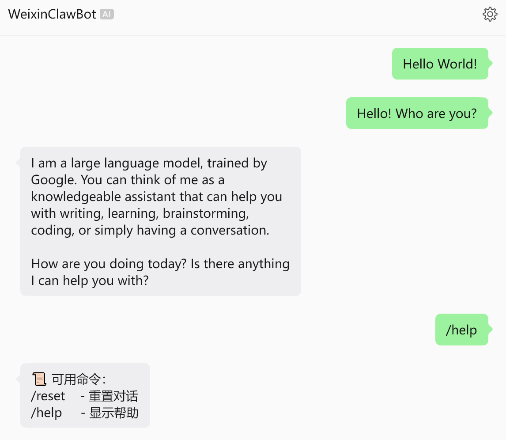
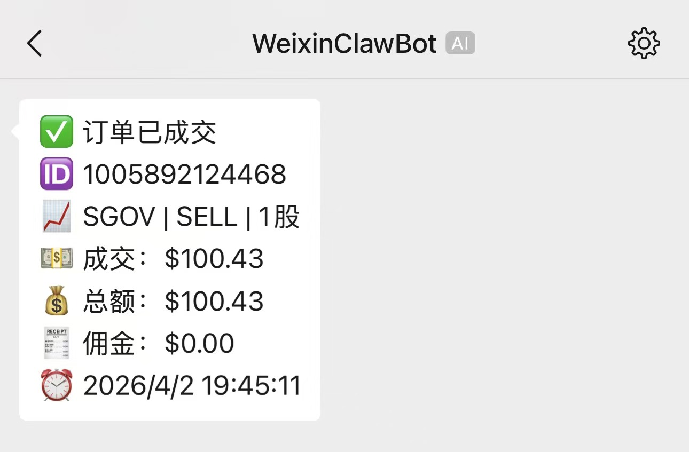
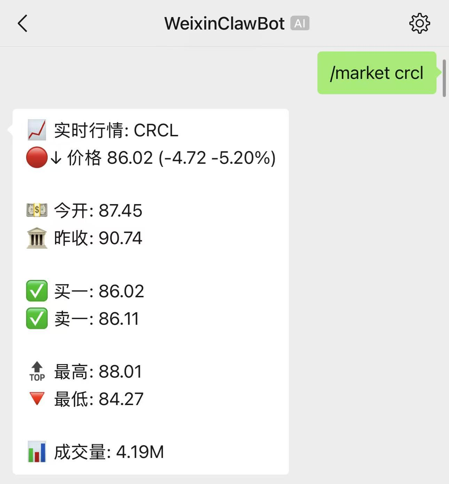
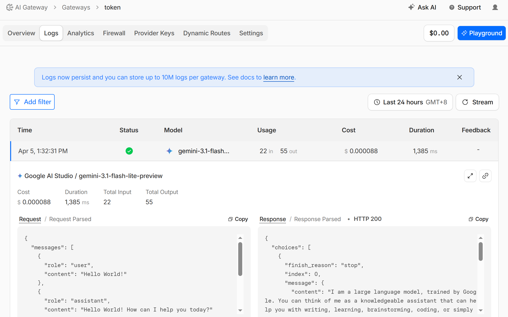

# MiniClaw - 微信 AI 聊天机器人
轻量化微信 AI 助手 | 支持自然对话 + 斜杠命令

---

## 🤖 项目介绍
MiniClaw 是一个专为微信打造的轻量化 AI 聊天机器人框架，基于模块化设计，可快速接入大语言模型（Gemini、GPT 等）。参考微信官方openclaw-weixin 整理的python接口，用于自己接入模型。推荐使用Cloudflare AI Gateway作为baseurl。

- 自然语言对话交互
- 自定义斜杠 `/` 命令系统
- 对话上下文管理与重置
- 可扩展自动化任务
- 结构简单，仅依赖```openai```和```aiohttp```库

---

## ✨ 核心功能

| 功能 | 说明 |
|------|------|
| 🧠 AI 自然对话 | 支持多轮上下文智能回复 |
| ⌨️ 斜杠命令 | /help /reset 等快捷指令 |
| 🔄 上下文重置 | 一键清空对话历史 |
| 🧩 模块化架构 | 主入口、AI核心、交互分离 |
| 📱 微信适配 | 完美运行在微信聊天环境 |

---

## 🖼️ 效果演示
<p align="center">
  
  <br><br>
  
  
</p>

- 直接聊天：AI 智能回复
- ```/help```：查看帮助
- ```/reset```：重置对话上下文
- ```/command```: 自定义斜杠命令 bypass大语言模型直接执行

---

## 📁 项目结构
```
miniclaw/
├── main.py          # 程序主入口、交互与命令处理
├── bot.py           # 微信消息接收与发送
├── chat.py          # 大语言模型交互
├── requirements.txt # 依赖
└── README.md        # 说明文档
```

---

## 🚀 快速开始

### 1. 克隆项目
```bash
git clone https://github.com/tokenlock/miniclaw.git
cd miniclaw
```

### 2. 安装依赖
```bash
pip install -r requirements.txt
```

### 3. 配置 API 密钥
- 编辑环境变量配置大模型API参数
```
export GEMINI_API_KEY="xxxxxxxxxxx"
export LLM_BASE_URL="https://gateway.ai.cloudflare.com/v1/xxx/xxx/compat"
```
-  编辑环境变量配置微信参数
```
微信参数来自来自openclaw-weixin扫码后存放的参数
本项目暂不支持直接扫码接入(Todo)
export WECHAT_BASE_URL="https://ilinkai.weixin.qq.com"
export WECHAT_TOKEN="xxxxxxxxx@im.bot:xxxxxxxxxxxxxxx"
export WECHAT_USER_ID="xxxxxxxxxxxxxxxxxxxx@im.wechat"
```

### 4. 启动
```bash
python main.py
```

---

## 📖 斜杠命令说明

| 命令 | 功能 |
|------|------|
| /help | 显示帮助 |
| /reset | 重置上下文 |

---

## 🧩 模块说明
-  ``` main.py ```：启动、斜杠命令解析和交互响应
-  ``` bot.py ``` ： 微信bot接口api
-  ``` chat.py ```：简化的大模型接口

---

## 📡 Todo
- 图像文件传输 
- 简单定时任务
- 微信扫码认证 
---

## 📄 License
MIT License